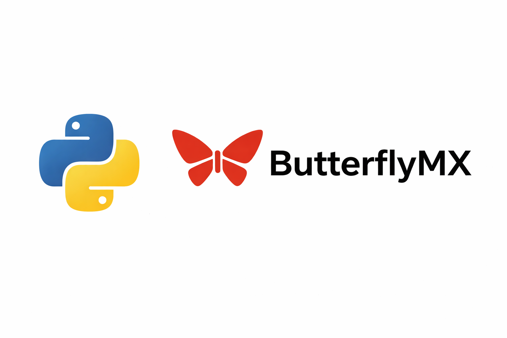

# ButterflyMX Python Client


> [!WARNING]
> **For educational and personal use only.** This library is an unofficial, independent project. It is not affiliated with, endorsed by, or supported by ButterflyMX. It works by using the same private API as the official mobile app, which can change or stop working at any time without notice.
>
> - Use it only with your own account and only for doors you are authorized to access.
> - You are responsible for complying with ButterflyMX's Terms of Service and your building's policies.
> - This software is provided "as is", without warranty of any kind. The authors are not liable for any damages, account suspensions, or security issues resulting from its use.

A reverse-engineered Python client for the ButterflyMX Intercom API. This client allows you to authenticate, retrieve tenant information, view messages and call history, and remotely unlock doors (access points).

## Features

- **Authentication**: The full OAuth 2.0 PKCE login flow the mobile app uses, with automatic token refresh.
- **Token storage your way**: Pass tokens in and get a callback when they change, or let the client manage a JSON file.
- **Data**: Tenants, doors, text messages, call history and access logs, individually or all in one request.
- **Remote unlock**: Open doors.
- **Async and typed**: Built on `aiohttp`, with type hints and clear exceptions.

## Installation

Requires Python 3.10+.

```bash
pip install git+https://github.com/Jxck-S/butterflymx-client.git
```

## Usage

```python
import asyncio
from butterflymx import ButterflyMXClient

async def main():
    async with ButterflyMXClient("you@example.com", "password", token_file="tokens.json") as client:
        for tenant in await client.get_tenants():
            overview = await tenant.get_overview()  # doors, messages, calls, access logs
            print(tenant.name, overview.doors)
            if overview.calls:
                print("Latest call:", overview.calls[0])

asyncio.run(main())
```

Or run the interactive example, which lists everything and lets you open a door:

```bash
python3 example.py
```

## API Documentation

### `ButterflyMXClient`

```python
ButterflyMXClient(
    email,
    password,
    *,
    session=None,
    token_file=None,
    tokens=None,
    on_tokens_updated=None,
    client_id=None,
    user_agent=None,
    request_timeout=15.0,
)
```

*   `email`, `password`: Your ButterflyMX login. The password is only used when a full login is needed.
*   `session`: An `aiohttp.ClientSession` to use for API requests. If omitted, the client creates its own. Close it with `await client.close()` or by using `async with`. A session you pass in is never closed by the client.
*   `token_file`: Path to a JSON file to load tokens from and save them to (owner-only permissions). Off by default.
*   `tokens`: Previously saved tokens (from `client.tokens`) to start with, so no login is needed.
*   `on_tokens_updated`: Called with the new tokens dict whenever they change, so you can save them yourself. Can be a regular or `async` function.
*   `client_id`: Override the OAuth client ID (see below).
*   `user_agent`: Override the `User-Agent` header. The default mimics the iOS app.
*   `request_timeout`: Total timeout in seconds for each HTTP request.

**Saving tokens yourself**

```python
client = ButterflyMXClient(email, password, tokens=load_saved(), on_tokens_updated=save)
```

**Authentication & token refresh**

Access tokens last about 24 hours. Every request checks the token first. If it is expired or within 60 seconds of expiring, the client refreshes it with the refresh token. If the refresh is rejected, it logs in again with your email and password. If a request still gets a `401`, the client refreshes and retries once. Concurrent requests share a single refresh.

**About the client ID**

The default `CLIENT_ID` is the public OAuth client ID that the official ButterflyMX mobile app uses. It is not a secret: the login uses PKCE, which is designed for apps that cannot keep secrets, and the ID is visible in the app's network traffic. If ButterflyMX changes it, you can find the new one by intercepting the app's login with a proxy like [mitmproxy](https://mitmproxy.org/) or Proxyman. Look for the `client_id` parameter on the request to `https://accounts.butterflymx.com/oauth/authorize`, then pass it as `client_id=...`.

**Methods**

*   **`async login() -> None`**: Makes sure the client is authenticated. You don't need to call it: every request does this first. Calling it up front is a handy way to check credentials.
*   **`async get_tenants() -> list[Tenant]`**: The tenants (units) on this account.
*   **`async query_graphql(query, variables=None) -> dict`**: Runs a raw GraphQL query and returns the response JSON.
*   **`tokens`**: The current tokens as a dict, in the format `tokens=` accepts.
*   **`async close() -> None`**: Closes the client's own HTTP session.

### `Tenant`

Attributes: `id`, `name`.

*   **`async get_overview() -> TenantOverview`**: Doors, messages, calls and access logs in **one request**. `TenantOverview` has `doors`, `messages`, `calls` and `access_logs` lists.
*   **`async get_doors() -> list[Door]`**: Doors (access points) this tenant can open.
*   **`async get_door(door_id) -> Door | None`**: One door, with fresh status.
*   **`async get_messages() -> list[Message]`**: Text messages, newest first.
*   **`async get_calls() -> list[Call]`**: Intercom call history, newest first.
*   **`async get_access_logs() -> list[Access]`**: Door releases, newest first.

### `Door`

Attributes: `id`, `name`, `online`, `open_duration`, `building_name`, `tenant_id`.

*   **`async open() -> None`**: Unlocks the door. Raises on failure.
*   **`async update() -> None`**: Refetches the door's details, e.g. `online`.

### `Message`

Attributes: `id`, `body`, `created_at`, `source` (device name, e.g. "Front Lobby"), `visitor_name`, `image_url`.

### `Call`

Attributes: `id`, `logged_at`, `status` (e.g. `OPENED_DOOR`, `MISSED`), `type` (e.g. `VISITOR`), `device`, `image_url`.

### `Access`

Attributes: `id`, `logged_at`, `type` (e.g. `TENANT`, `VISITOR`), `method` (e.g. `SWIPE_TO_OPEN`), `door_name`, `device_name`, `image_url`.

### Exceptions

All errors inherit from `ButterflyMXError`:

| Exception | When | What to do |
|---|---|---|
| `ButterflyMXAuthError` | Wrong email/password, or tokens rejected even after refreshing | Fix the credentials; retrying won't help |
| `ButterflyMXConnectionError` | Network error, timeout, or a 5xx from ButterflyMX | Usually temporary; retry later |
| `ButterflyMXApiError` | Unexpected response: GraphQL errors, non-JSON, or a changed login page | Likely an API change; please open an issue |

### Upgrading from 1.x

*   `login()` and `Door.open()` return `None` and raise on failure instead of returning `False`.
*   `query_graphql()` and the `get_*` methods raise instead of returning `None` / `[]`.
*   Options after `password` are keyword-only, and `token_file` is off by default. Pass `token_file="tokens.json"` to keep the old behavior.
*   `authed_post()` and `get_headers()` are now private.

## Logging

The library logs through Python's `logging` module under the `butterflymx` logger. To see what it's doing:

```python
import logging
logging.basicConfig(level=logging.DEBUG)
```

## Development

The tests run against a local fake ButterflyMX server, so they never touch the real API or need an account.

```bash
pip install -e ".[dev]"
ruff check .
mypy
pytest
```

CI runs all three on every push and pull request.

## License

[MIT](LICENSE). See the disclaimer at the top: this is an unofficial project, not affiliated with ButterflyMX.
